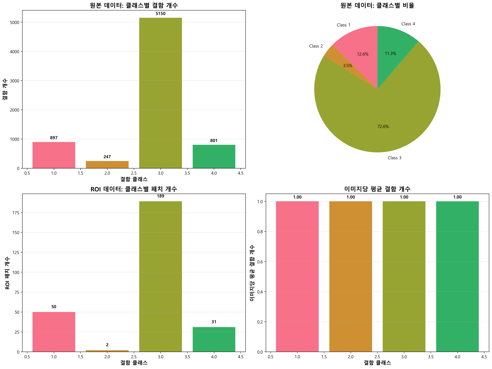
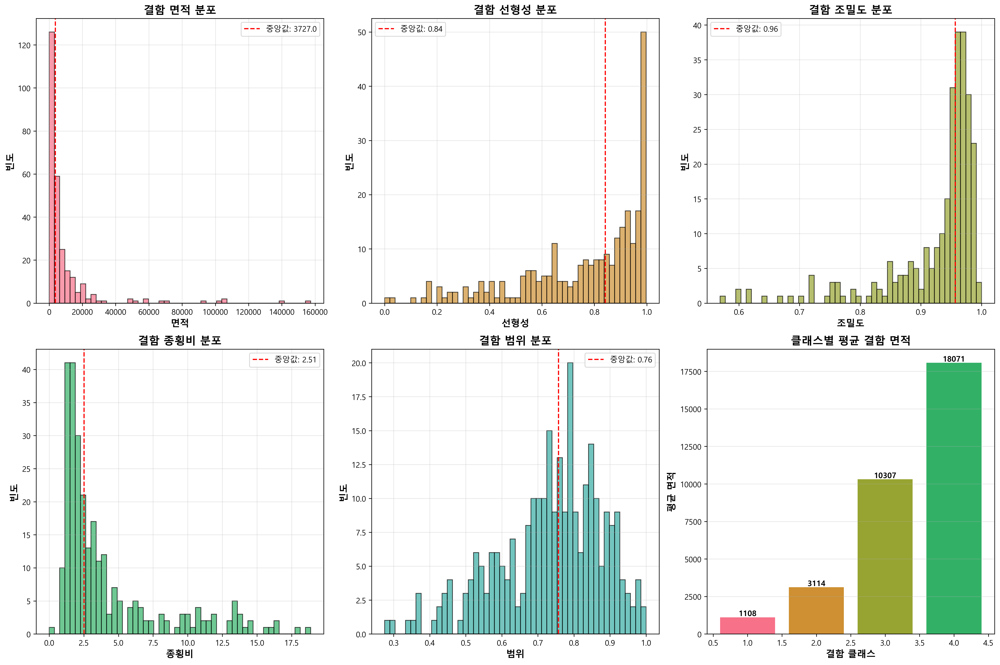
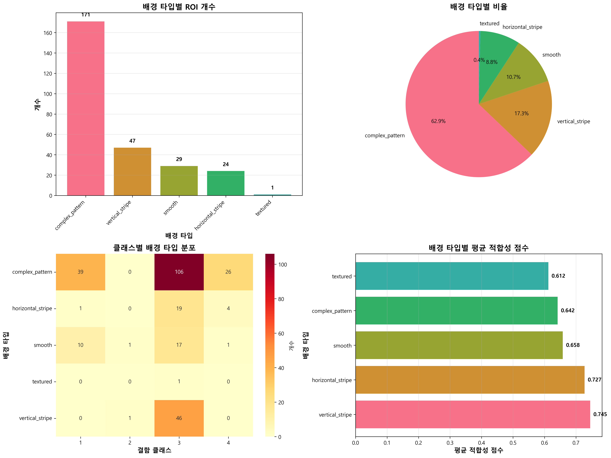
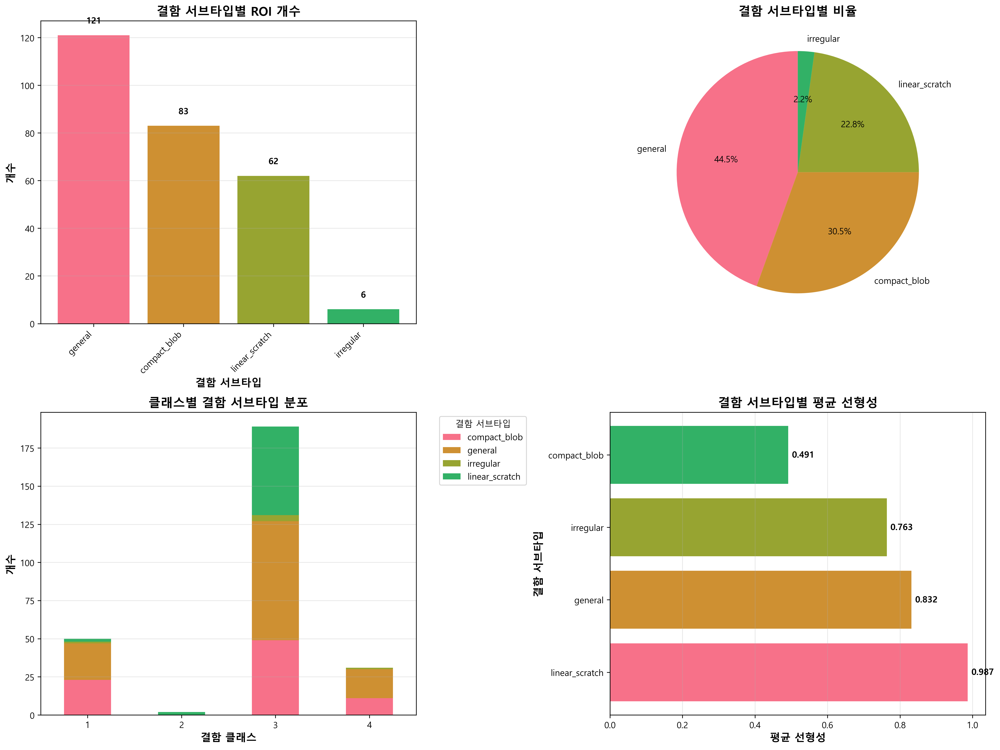
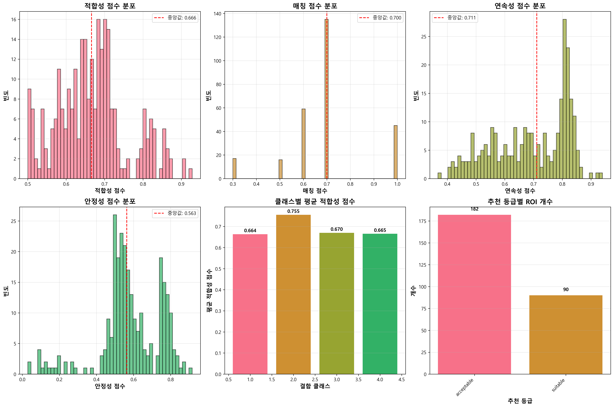

# 데이터 시각화 가이드

본 문서는 Severstal Steel Defect Detection 프로젝트의 데이터 시각화에 대한 가이드입니다.

## 목차
- [개요](#개요)
- [시각화 스크립트](#시각화-스크립트)
- [설치 방법](#설치-방법)
- [실행 방법](#실행-방법)
- [생성되는 시각화](#생성되는-시각화)
- [데이터 통계 요약](#데이터-통계-요약)

## 개요

이 프로젝트는 강철 표면의 결함을 탐지하는 데이터셋을 분석하고 시각화합니다. 시각화 스크립트는 다음 데이터를 활용합니다:

- **train.csv**: 원본 학습 데이터 (ImageId, ClassId, EncodedPixels)
- **roi_metadata.csv**: 추출된 ROI 패치의 메타데이터 및 특성 정보
- **train_images/**: 12,568개의 원본 훈련 이미지
- **roi_patches/images/**: 추출된 ROI 패치 이미지들

## 시각화 스크립트

### 위치
```
scripts/visualize_data.py
```

### 주요 기능
- 5가지 주요 시각화 분석
- 고해상도 PNG 이미지 생성 (300 DPI)
- 통계 요약 텍스트 파일 생성
- 한글 지원 (Malgun Gothic 폰트)

## 설치 방법

### 1. Python 환경 확인
```bash
python --version  # Python 3.7 이상 권장
```

### 2. 필요한 패키지 설치
```bash
pip install pandas matplotlib seaborn numpy
```

또는 requirements.txt를 사용:
```bash
pip install -r requirements.txt
```

### 3. 폰트 설정 (선택사항)
한글이 깨지는 경우, 시스템에 'Malgun Gothic' 폰트가 설치되어 있는지 확인하세요.

**Windows**: 기본적으로 설치되어 있음  
**Linux/Mac**: 다른 한글 폰트로 변경 필요
```python
# scripts/visualize_data.py 파일에서 수정
plt.rcParams['font.family'] = 'AppleGothic'  # Mac
plt.rcParams['font.family'] = 'NanumGothic'  # Linux
```

## 실행 방법

### 기본 실행
```bash
# 프로젝트 루트 디렉토리에서
python scripts/visualize_data.py
```

### 출력 확인
실행 후 `visualizations/` 디렉토리가 생성되며, 다음과 같은 메시지가 출력됩니다:
```
데이터를 로드하는 중...
1. 클래스별 데이터 분포 분석 중...
  → 저장: visualizations/01_class_distribution.png
2. ROI 메타데이터 분석 중...
  → 저장: visualizations/02_roi_metadata.png
...
모든 시각화 완료!
```

## 생성되는 시각화

### 1. 클래스별 데이터 분포 분석 (`01_class_distribution.png`)


**포함 내용:**
- 원본 데이터의 클래스별 결함 개수 (바 차트)
- 클래스별 비율 (파이 차트)
- ROI 패치의 클래스별 개수 (바 차트)
- 이미지당 평균 결함 개수 (바 차트)

**분석 포인트:**
- 4가지 결함 클래스(1-4)의 분포가 균등한지 확인
- 클래스 불균형(class imbalance) 파악
- ROI 추출 후 데이터 분포 변화 확인

---

### 2. ROI 메타데이터 분석 (`02_roi_metadata.png`)


**포함 내용:**
- **Area (면적)**: 결함의 픽셀 크기 분포
- **Linearity (선형성)**: 결함이 얼마나 선형인지 (0-1)
- **Solidity (조밀도)**: 결함이 얼마나 밀집되어 있는지 (0-1)
- **Aspect Ratio (종횡비)**: 결함의 가로/세로 비율
- **Extent (범위)**: 바운딩 박스 대비 실제 결함 비율 (0-1)
- 클래스별 평균 면적 비교

**분석 포인트:**
- 결함의 형태적 특성 이해
- 클래스별 결함 크기 차이 파악
- 이상치(outlier) 탐지

---

### 3. 배경 타입별 분석 (`03_background_type.png`)


**포함 내용:**
- 배경 타입별 ROI 개수
  - `smooth`: 매끄러운 표면
  - `horizontal_stripe`: 수평 줄무늬
  - `vertical_stripe`: 수직 줄무늬
  - `complex_pattern`: 복잡한 패턴
- 배경 타입별 비율 (파이 차트)
- 클래스별 배경 타입 분포 (히트맵)
- 배경 타입별 평균 적합성 점수

**분석 포인트:**
- 결함이 어떤 배경에서 주로 발생하는지 파악
- 배경 타입과 결함 클래스의 상관관계
- ControlNet 학습을 위한 최적 배경 타입 선정

---

### 4. 결함 서브타입 분석 (`04_defect_subtype.png`)


**포함 내용:**
- 결함 서브타입별 ROI 개수
  - `general`: 일반적인 결함
  - `linear_scratch`: 선형 스크래치
  - `compact_blob`: 밀집된 덩어리형 결함
- 결함 서브타입별 비율 (파이 차트)
- 클래스별 결함 서브타입 분포 (스택 바 차트)
- 결함 서브타입별 평균 선형성

**분석 포인트:**
- 결함의 세부 유형 파악
- 각 클래스의 주요 결함 패턴 이해
- 서브타입별 형태적 특징 확인

---

### 5. 적합성 점수 분석 (`05_suitability_scores.png`)


**포함 내용:**
- **Suitability Score**: 종합 적합성 점수 (0-1)
- **Matching Score**: 결함-배경 매칭 점수 (0-1)
- **Continuity Score**: 결함 연속성 점수 (0-1)
- **Stability Score**: 안정성 점수 (0-1)
- 클래스별 평균 적합성 점수
- 추천 등급 분포 (`suitable` vs `acceptable`)

**분석 포인트:**
- ControlNet 학습에 적합한 ROI 선별
- 점수 분포를 통한 데이터 품질 평가
- 클래스별 데이터 품질 차이 확인

---

### 6. 통계 요약 (`statistics_summary.txt`)

텍스트 형식의 상세 통계 정보:

```
================================================================================
강철 결함 데이터 통계 요약
================================================================================

1. 기본 데이터 통계
--------------------------------------------------------------------------------
총 이미지 수: 12568
총 결함 수 (train.csv): XXXX
총 ROI 패치 수: XXX
이미지당 평균 결함 수: X.XX

2. 클래스별 통계
--------------------------------------------------------------------------------
클래스 1:
  - 결함 수: XXX
  - ROI 패치 수: XX
  - 평균 면적: XXX.XX
  - 평균 적합성 점수: 0.XXX

[각 클래스별 통계 반복]

3. 배경 타입별 통계
--------------------------------------------------------------------------------
[배경 타입별 개수, 비율, 적합성 점수]

4. 결함 서브타입별 통계
--------------------------------------------------------------------------------
[서브타입별 개수, 비율, 선형성]

5. 적합성 점수 통계
--------------------------------------------------------------------------------
[각 점수의 평균, 중앙값, 최소/최대값, 추천 등급 분포]
```

## 데이터 통계 요약

### 결함 클래스 설명
- **Class 1**: 수평 결함 (일반적으로 긴 수평 스크래치)
- **Class 2**: 수직 결함 (일반적으로 긴 수직 스크래치)
- **Class 3**: 점형 결함 (작은 점 또는 작은 덩어리)
- **Class 4**: 큰 면적 결함 (큰 덩어리 또는 패치)

### ROI 메타데이터 필드 설명

| 필드명 | 설명 | 범위 |
|--------|------|------|
| `area` | 결함의 픽셀 면적 | 양의 정수 |
| `linearity` | 결함의 선형성 (1에 가까울수록 직선에 가까움) | 0-1 |
| `solidity` | 조밀도 (결함이 얼마나 밀집되어 있는지) | 0-1 |
| `extent` | 바운딩 박스 대비 실제 결함 비율 | 0-1 |
| `aspect_ratio` | 종횡비 (높이/너비) | 양수 |
| `defect_subtype` | 결함 서브타입 (general, linear_scratch, compact_blob) | 문자열 |
| `background_type` | 배경 타입 (smooth, horizontal_stripe, vertical_stripe, complex_pattern) | 문자열 |
| `suitability_score` | 종합 적합성 점수 | 0-1 |
| `matching_score` | 결함-배경 매칭 점수 | 0-1 |
| `continuity_score` | 결함 연속성 점수 | 0-1 |
| `stability_score` | 안정성 점수 | 0-1 |
| `recommendation` | 추천 등급 (suitable, acceptable, poor) | 문자열 |

### 적합성 점수 계산 방식

**Suitability Score**는 다음 3가지 요소를 종합하여 계산됩니다:

1. **Matching Score (0.7 가중치)**
   - 결함 서브타입과 배경 타입의 매칭 점수
   - 예: linear_scratch + vertical_stripe = 1.0 (완벽한 매칭)
   
2. **Continuity Score (가변 가중치)**
   - 결함의 연속성 및 명확성
   - linearity, solidity, extent 값을 기반으로 계산
   
3. **Stability Score (가변 가중치)**
   - 배경 타입별 안정성
   - smooth > horizontal_stripe/vertical_stripe > complex_pattern

**추천 등급:**
- `suitable`: suitability_score ≥ 0.7
- `acceptable`: 0.5 ≤ suitability_score < 0.7
- `poor`: suitability_score < 0.5

## 활용 방안

### 1. 데이터 품질 평가
- 각 클래스의 데이터 분포 확인
- 클래스 불균형 문제 파악
- 적합성 점수를 통한 품질 평가

### 2. ControlNet 학습 데이터 선별
- `suitable` 등급의 ROI 우선 선택
- 배경 타입별로 균등하게 샘플링
- 서브타입별 다양성 확보

### 3. 데이터 증강 전략 수립
- 부족한 클래스에 대한 증강 필요성 판단
- 배경 타입별 증강 강도 조절
- 결함 특성을 고려한 증강 방법 선택

### 4. 모델 평가 기준 설정
- 클래스별 성능 목표 설정
- 배경 타입별 성능 분석 기준 마련
- 적합성 점수를 활용한 테스트 세트 구성

## 문제 해결

### 한글 폰트가 깨지는 경우
```python
# scripts/visualize_data.py 수정
plt.rcParams['font.family'] = 'DejaVu Sans'  # 영문 폰트로 변경
```

### 메모리 부족 오류
```python
# 이미지 해상도를 낮춤 (scripts/visualize_data.py에서 수정)
plt.savefig(output_dir / '01_class_distribution.png', dpi=150, bbox_inches='tight')
```

### 데이터 파일을 찾을 수 없는 경우
- 현재 작업 디렉토리가 프로젝트 루트인지 확인
- `train.csv`와 `data/processed/roi_patches/roi_metadata.csv` 파일이 존재하는지 확인

## 추가 분석 제안

시각화 스크립트를 확장하여 다음과 같은 추가 분석이 가능합니다:

1. **샘플 이미지 시각화**: 각 클래스/타입별 대표 이미지 표시
2. **상관관계 분석**: 메타데이터 간 상관관계 히트맵
3. **시계열 분석**: 이미지 파일명 기반 시간대별 결함 분포
4. **공간 분석**: 결함의 위치(centroid) 분포 히트맵
5. **차원 축소**: PCA/t-SNE를 통한 결함 클러스터 시각화

## 관련 문서

- [README.md](README.md): 프로젝트 전체 개요
- [README_ROI.md](README_ROI.md): ROI 추출 가이드
- [README_AUGMENTATION.md](README_AUGMENTATION.md): 데이터 증강 가이드
- [README_COMPLETE_PIPELINE.md](README_COMPLETE_PIPELINE.md): 전체 파이프라인 가이드

## 라이선스

본 프로젝트는 Severstal Steel Defect Detection 데이터셋을 기반으로 합니다.

## 문의

문제가 발생하거나 질문이 있으면 이슈를 등록해주세요.
